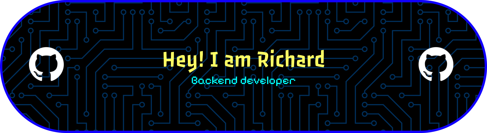

  

 

  
  
  

### 👋 About Me
Hi there! I'm a university student with a strong interest in Backend and Mobile Development. I enjoy building systems and learning how things work behind the scenes.

- 🔭 I’m currently focusing on my university studies while building personal projects.
- 🌱 I’m currently deepening my knowledge in **Laravel**, **Flutter**, and database management (**MySQL**).
- ⚡ Fun fact: I enjoy discussing logic algorithms and diving into UI/UX design concepts.

### 💻 Tech Stack

  
  
  
  
  
  
  
  
  
  
  
  
  
  
  
  
  

### 📊 GitHub Analytics

  
  

  

  

### 👾 Activity Graph

  

